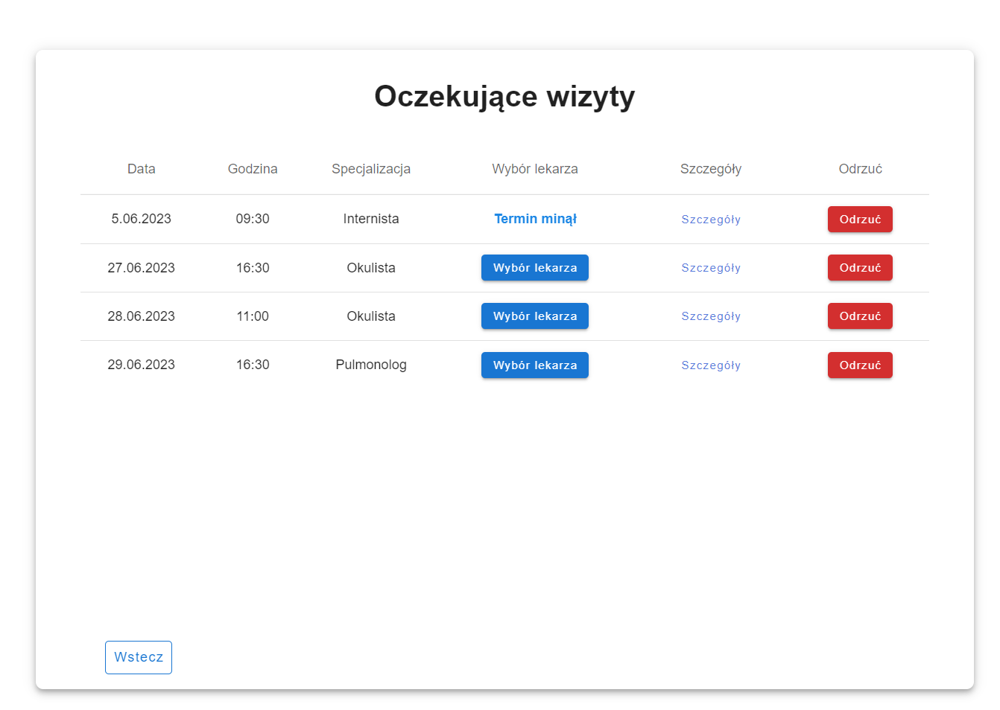
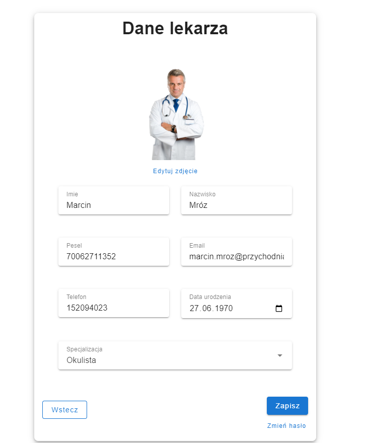
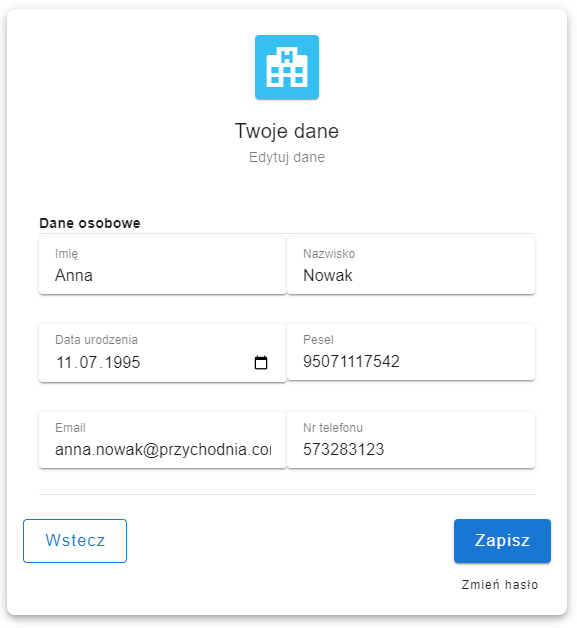
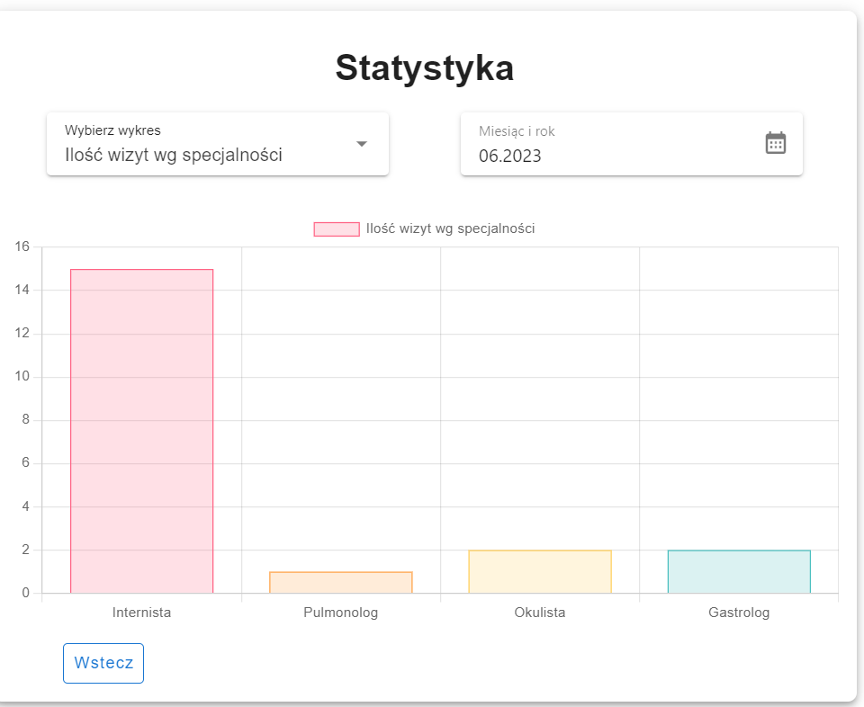

  <h1 align="center">⚕️ Application for a medical clinic ⚕️</h1>

  

    The project was developed for a faculty subject at the university.
     
    
  

 

## About the project

  The project was created by a group of students. The system consists of a frontend application and a web API. 
  Designed to simplify the process for patients to schedule doctor's appointments and for clinic staff to efficiently manage visits.  
  Main functionalities:
  <ul>
    <li>booking appointments,</li>
    <li>managing appointments,</li>
    <li>managing user account,</li>
    <li>sending an e-mail reminder,</li>
    <li>chart summary of the month.</li>
    <li>managing the profiles of doctors</li>
  </ul>

## Built with
 [![Vue][Vue.js]][Vue-url]
 [![Typescript][TypeScript]][TypeScript-url]
 [![Dotnet][DotnetCore]][Dotnet-url]
 [![MSSQL][MSSQLServer]][MSSQLServer-url]
 [![Azure][Azure]][Azure-url]

[Vue.js]: https://img.shields.io/badge/Vue.js-35495E?style=for-the-badge&logo=vuedotjs&logoColor=4FC08D
[Vue-url]: https://vuejs.org/
[TypeScript]: https://img.shields.io/badge/TypeScript-007ACC?style=for-the-badge&logo=typescript&logoColor=white
[TypeScript-url]: https://www.typescriptlang.org
[DotnetCore]: https://img.shields.io/badge/ASP.NET_Core-5C2D91?style=for-the-badge&logo=.net&logoColor=white
[Dotnet-url]: https://learn.microsoft.com/en-us/aspnet/core/?view=aspnetcore-7.0
[MSSQLServer]: https://img.shields.io/badge/Microsoft%20SQL%20Server-CC2927?style=for-the-badge&logo=microsoft%20sql%20server&logoColor=white
[MSSQLServer-url]: https://www.microsoft.com/en-us/sql-server
[Azure]: https://img.shields.io/badge/Microsoft_Azure-0089D6?style=for-the-badge&logo=microsoft-azure&logoColor=white
[Azure-url]:https://azure.microsoft.com/

## Screenshots

  
  
  
  
  
  
  

